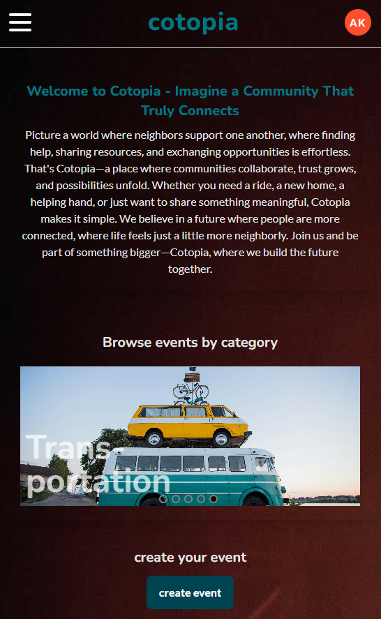

# cotopia

### Description

This repository contains the React frontend for the final project of the Ironhack Web Development Bootcamp.

cotopia is a single page website on which people can exchange offers or requests for events, help, real estate, trade or transportation with the community. The idea of this platform is to provide one place for communities rather than having multiple messanger groups.

Frontend Tech-Stack:

- JavaScript
- React
- Axios
- Tailwind CSS
- Vite
- Flowbite React
- Toastify
- Phosphoricons
- git

The backend repository can be found here: [cotopia-backend](https://github.com/andrekaltenbach/cotopia-backend)

### Instructions to run this app in my computer

- fork the repository
- clone the repository (git clone)
- navigate to directory of the clone
- install dependencies: `npm install`
- setup environment variables in .env:
  - create a file `.env` in the root directory
  - `VITE_SERVER_URL = 'http://localhost:5005'`
- run the app: `npm run dev -- --port 3000`

### Demo

This app was deployed using Netlify.
You can find the deployed version here: [cotopia-app](https://cotopia-app.netlify.app/)
